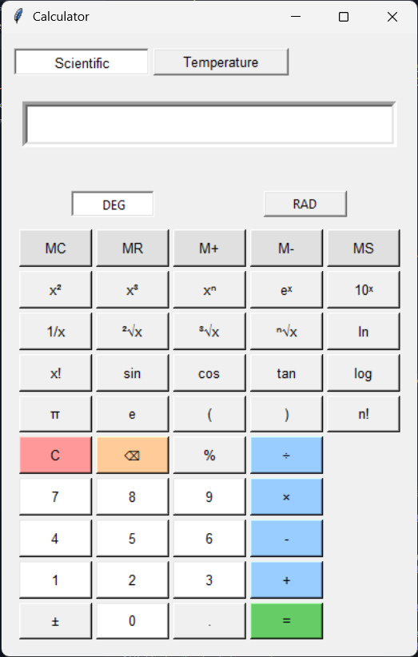
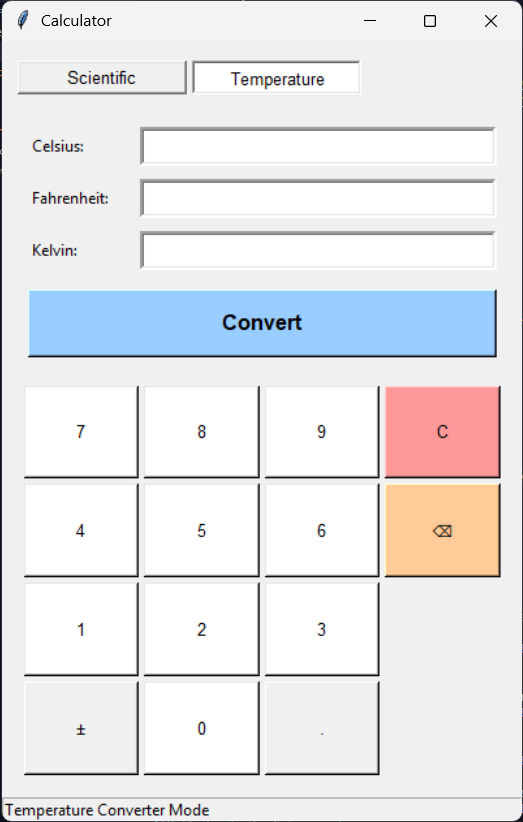

# Proyek Replikasi Calculator Windows

aplikasi kalkulator dengan fokus pada mode Scientific dan fitur Temperature Converter menggunakan GUI Tkinter dalam bahasa Python.

## Fitur

### Scientific Calculator

- Operasi aritmatika dasar (+, -, ×, ÷)
- Fungsi trigonometri (sin, cos, tan) dan inversnya
- Fungsi logaritma (log10, ln) dan eksponensial
- Operasi pangkat dan akar (x², x³, x^n, √x, ∛x)
- Konversi mode sudut (DEG/RAD)
- Fungsi memori (MC, MR, M+, M-, MS)

### Temperature Converter

- Konversi antara Celsius, Fahrenheit, dan Kelvin
- Input dengan keypad virtual
- Manipulasi input (±, backspace, clear)

## Struktur Proyek

```
calculator_app/
├── main.py             # File aplikasi utama
├── scientific_calc.py  # Logika kalkulator scientific
├── temp_converter.py   # Logika konverter suhu
└── ui/
    ├── __init__.py         # Penanda paket
    ├── common_ui.py        # Komponen UI bersama
    ├── scientific_ui.py    # UI kalkulator scientific
    └── temperature_ui.py   # UI konverter suhu
```

## Instalasi

1. Pastikan Python 3.x sudah terinstal
2. Clone repositori ini:
   ```
   git clone https://github.com/Ysfii-Dev/calculator_app.git
   cd calculator_app
   ```
3. Jalankan aplikasi:
   ```
   python main.py
   ```

## Cara Penggunaan

### Mode Scientific Calculator

- Gunakan tombol angka untuk memasukkan nilai
- Pilih mode sudut (DEG/RAD) untuk fungsi trigonometri
- Fungsi scientific tersedia melalui tombol-tombol khusus
- Tekan "=" untuk menghitung hasil

### Mode Temperature Converter

- Masukkan nilai pada salah satu kolom suhu
- Klik "Convert" untuk melihat nilai ekuivalen di skala lain
- Gunakan keypad virtual untuk input
- "C" menghapus semua nilai

## Tangkapan Layar




## Persyaratan

- Python 3.6 atau lebih tinggi
- Tkinter (sudah termasuk dalam sebagian besar instalasi Python)

## Pengembangan

Proyek ini mendemonstrasikan:

- Pemrograman berorientasi objek dengan Python
- Pengembangan GUI menggunakan Tkinter
- Arsitektur modular yang memisahkan logika dari presentasi
- Replikasi fungsionalitas software yang sudah ada

## Lisensi

MIT License

## Referensi

- Terinspirasi dari aplikasi Calculator Microsoft Windows
